#### 💫 A chef Who loves to cook visually appealing web applications with different technologies.

Hello, I am yeasin form Dhaka and I am 22 year old. I'm a self-taught front-end focused Full Stack Web Developer. TypeScript and Nextjs enthusiast. I have been doing freelance project from last 1 year and working with teams to make good projects.
Wanna collaborate? Let's build something amazing together! 🖤

- 💬 Loves to Talk about Technology, Software, Coding, And Ideas
- 🤝 Open for Collaboration, Excited to collaborate on innovative projects.
- 🌱 Explorering Back-End, Database,Linux etc.

### Enthusiast For

### Contact Info

 
    
 
 

 
 
 

### Statistics

<table>
  <tr>
    <td> 
    
     </td>
    <td>
      
     </td>
  </tr>
</table>

<table>
  <tr>
<td> 
    
</td>
  </tr>
</table>

<!--

  <h4 > 📈 More GitHub States (Click to Open) </h4> 

<be>

-->

