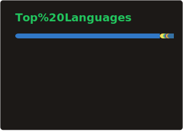
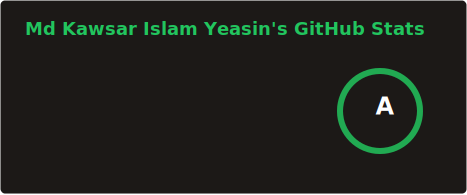

#### 💫 A chef who loves to cook visually appealing web applications with different technologies.

Hello, I am yeasin form Dhaka and I am 22 year old. I'm a  front-end focused Full Stack Web Developer: TypeScript and NextJS enthusiast. I have been doing freelance project from last 2 year and working with teams to make good projects.
Wanna collaborate? Let's build something amazing together! 🖤

- 💬 Loves to Talk about Technology, Software, Coding, And Ideas
- 🤝 Open for Collaboration, Excited to collaborate on innovative projects.
- 🌱 Explorering Back-End, Database,Linux etc.

### Enthusiast For

### Projects Showcase 👨‍💻

#### Open Source Contribution 
- 📚 **[shadcn-ui](https://github.com/shadcn-ui/ui)** -  
  - Bug fix: added validation on user input prompt that was crashing the CLI
  - eslint config issue in next-monorepo template

- 📚 **[skald](https://github.com/skaldlabs/skald)** -  
  - feat: added auto-generate openapi spec
  - fix(UI): user name and email on Sider 

- 📚 **[TailAdmin/admin-dashboard](https://github.com/TailAdmin/free-nextjs-admin-dashboard)** -  
  - feat: migrated to Nextjs 16 from 15 
  - fix: turborepo SVGR compatibility issue with NextJS 16
    
#### Development Tools (Under Development)

-  🍞 **[twist-toast](https://github.com/yeasin2002/twist-toast)**     - headless toast library manages behavior not design 
- 📚 **[cls-extended](https://github.com/yeasin2002/cls-extended)** -  Tailwind CSS responsive utilities with better developer experience.
- 👟 **[better-next-app](https://github.com/yeasin2002/better-next-app)** - CLI tool for scaffolding Next.js projects with extended feature, written in Go. 

#### Starter/Boilerplate templates

-  ⏭️ **[bulletproof-nextjs-starter](https://github.com/yeasin2002/bulletproof-nextjs-starter)** -  - A production-ready Next.js boilerplate with enterprise-grade features
- 🌊 **[react-ts-starter](https://github.com/yeasin2002/react-ts-starter)**  -  -  Vite react-TS starter  for blazing-fast development
-  👻 **[express-ts-starter](https://github.com/yeasin2002/express-ts-starter)**  -  -  TypeScript,Express with Docker, build tool to build hight scalable Backend. 
- 📦 **[npm-starter](https://github.com/yeasin2002/npm-starter)**  -  - Starter Template for creating NPM Packages
-  🔌 **[unplugin-starter](https://github.com/yeasin2002/unplugin-starter)**  - Create cross platform build tools plugins like vite,rollup, farm, webpack etc.
-  ⚛️ **[react-native expo starter](https://github.com/yeasin2002/react-native-expo-starter)**  - A production-ready starter template for cross-platform mobile apps with Expo

#### Browser Extensions

-  🤖 **[promptsu](https://github.com/yeasin2002/promptsu)**  - Add AI-powered prompt enhancement to chatGPT etc.
- 🖥️ **[ResponsiveKit](https://github.com/yeasin2002/ResponsiveKit)** -  Displays real-time responsive breakpoint information while browsing 

### Contact Info

 
    
 

    

### GitHub Statistics/States

Click here to see the Magic!!! 🪄 

 

<table>
  <tr>
    <td> 
    
     </td>
    <td>
      
     </td>
  </tr>
</table>

<table>
  <tr>
<td> 
    
</td>
  </tr>
</table>

<!--

  <h4 > 📈 More GitHub States (Click to Open) </h4> 

<be>

-->

